# 【3d-game-hw5】Dont-let-the-night-fall3D弩箭射击游戏

## 1 游戏规则简介

本项目是一款基于Unity的3D弩箭射击游戏，玩家需要在**白天**、**黄昏** 和 **夜晚**的时间循环的场景中射击固定靶和会追踪玩家的运动靶，击中固定靶子得分，击中运动靶来延缓其追上玩家的时间，每轮游戏在运动靶追上玩家时结束，记录击中固定靶子的最多数量，一个一分；玩家弩箭可以调整射击力量以调整射程，总共10根箭，回收规则为击中固定靶子或者射偏要靠近到一定范围去捡，射中移动靶子的箭不可收回。

**时间规则说明：**

**白天（Day）**:运动靶子（追逐者）慢速匀速追踪玩家，无固定靶子，玩家尽量拉开与追逐者的距离，10s后变到黄昏。

**黄昏（Dusk）**:运动靶子（追逐者）快速匀速追踪玩家，游戏在可击中区域随机生成20个固定靶子，靶子被击中后5s后会在随机区域生成新靶子，但不超过20个；玩家在进入夜晚前击中2个固定靶子则可回到白天状态，否则10s后进入夜晚

**夜晚（Night）**:运动靶子（追逐者）从黄昏的速度开始逐渐加速，固定靶子逻辑不变，玩家击中5个固定靶子则可回到黄昏状态，若击不中足够的目标，夜晚持续加速增加追逐者的威胁。

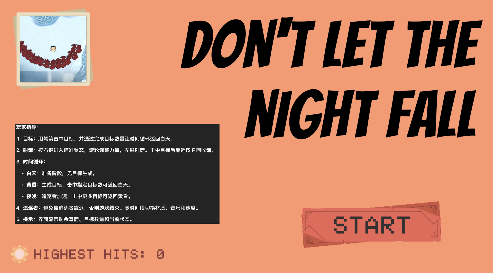

## 2 Assets架构

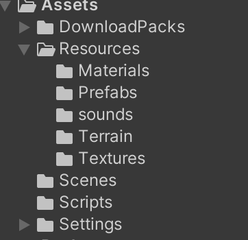

## 3 采分点实现说明

### 游戏场景（14分）

-  地形（2分）：使用**地形组件**，上面有**山、路、草、树**

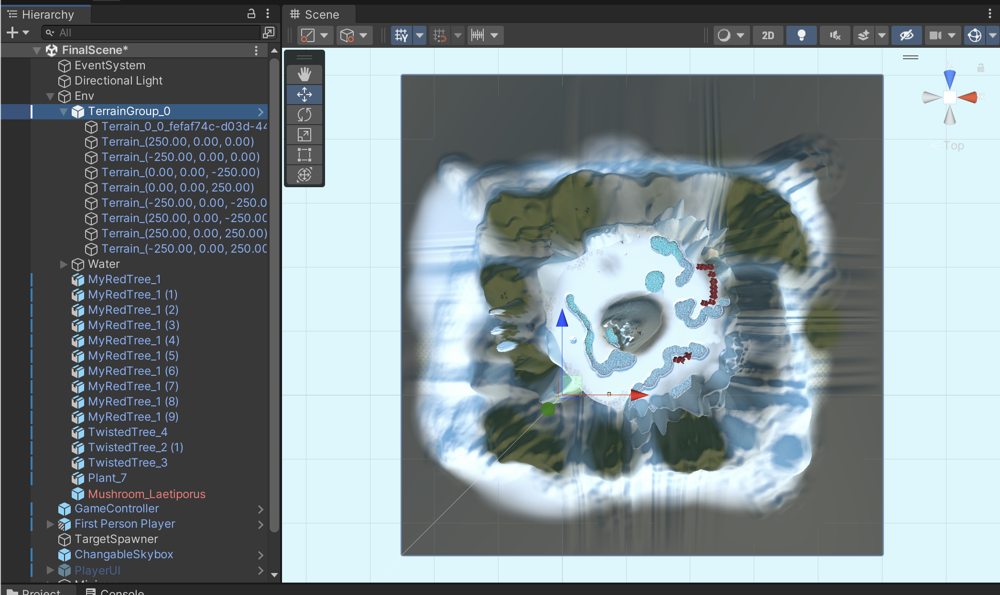

-  天空盒（2分）：使用**天空盒**，天空可随 玩家位置 或 时间变化 或 按特定按键**切换天空盒**

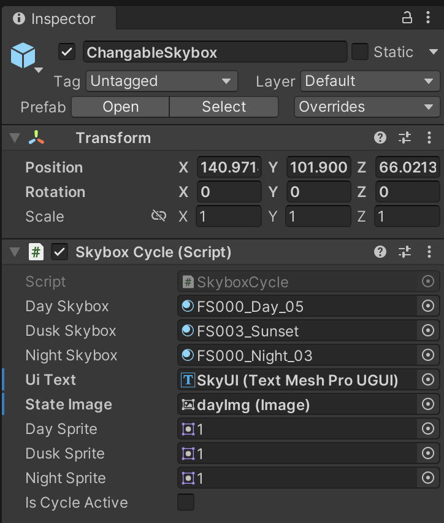

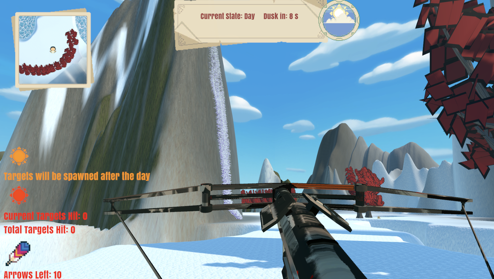

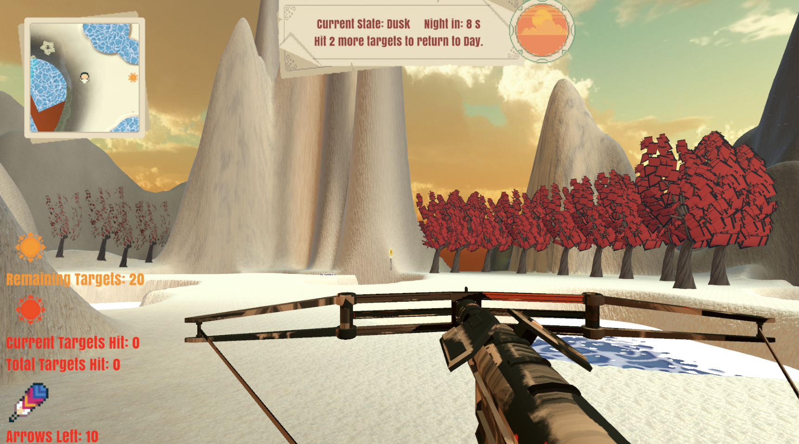

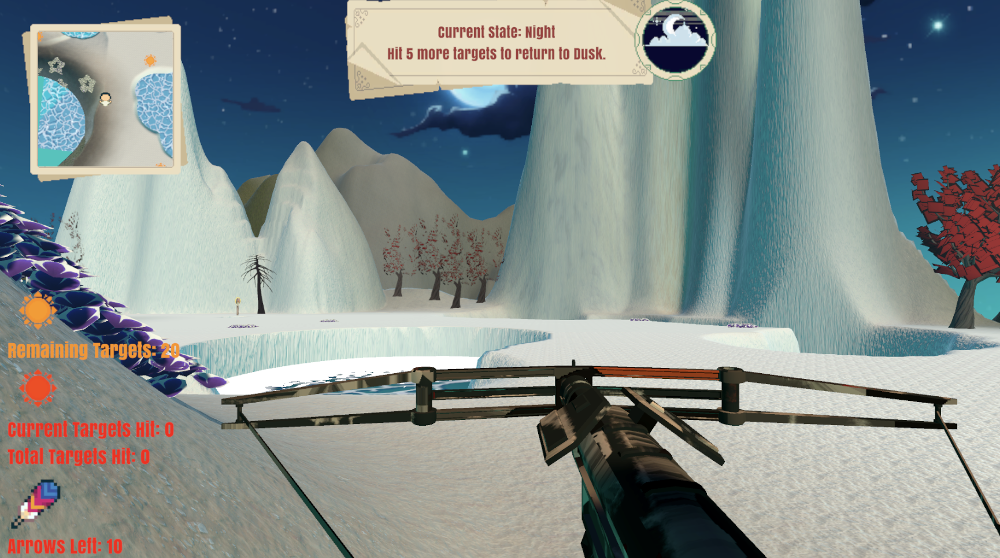

-  固定靶（2分）：使用**静态物体**，有一个以上固定的靶标；（注：射中后状态不会变化）

射中前：

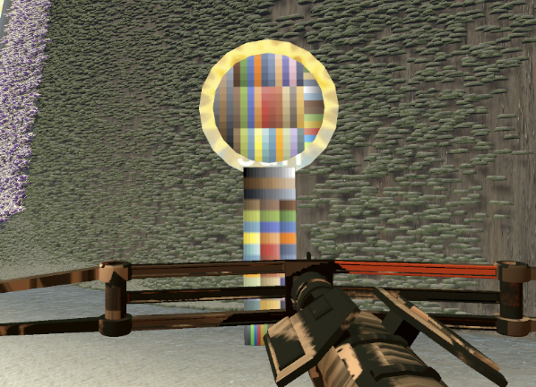

射中后：

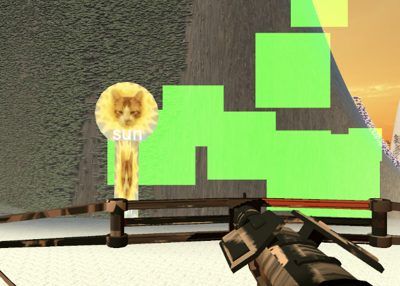

绿色粒子效果表示进入可拾取范围，黄色则是不再，按F捡起箭后被击中的固定靶子消失。

-  运动靶（2分）：

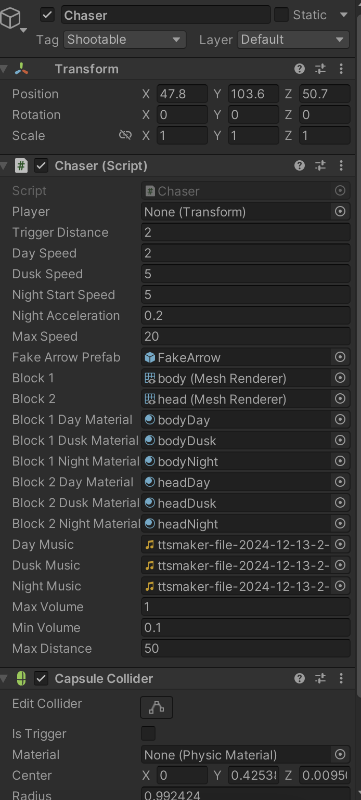

白天运动靶子：

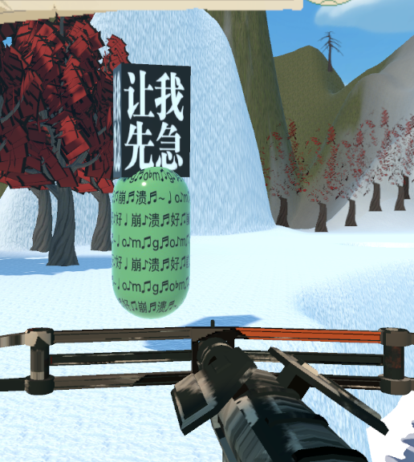

黄昏运动靶子：

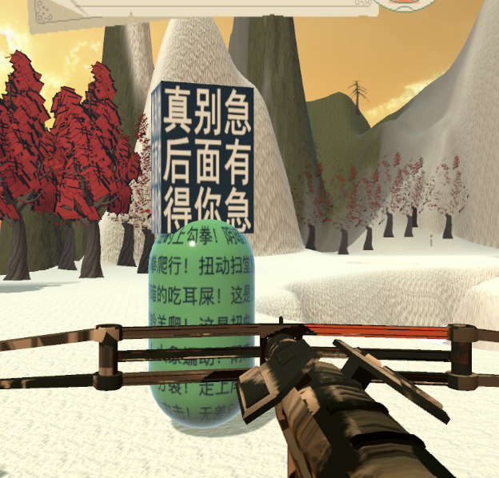

夜晚运动靶子：

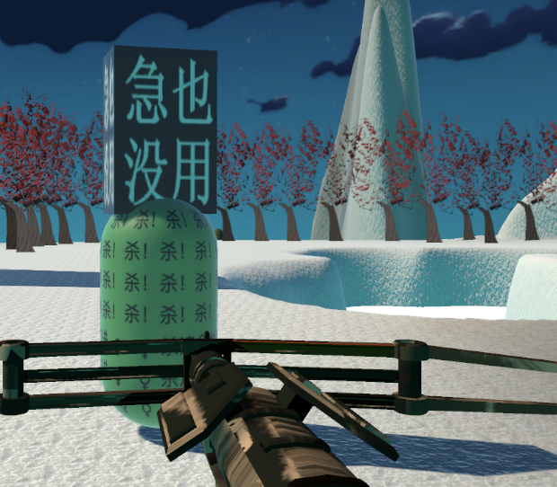

-  射击位（2分）：设计为可移动区域均可设计。

-  摄像机（2分）：使用**多摄像机**，制作了小地图，player, chaser, target都有小标识：

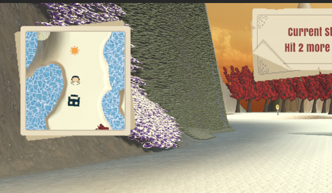

-  声音（2分）：使用**声音组件**，播放背景音 与 箭射出的声效：
  - 背景音乐随时间状态（白天、黄昏、夜晚）切换。
  - 射击、命中、追逐者接近等场景配有特定音效，增强沉浸感。

### 运动与物理与动画（8分）

-  游走（2分）：使用**第一人称组件**，玩家的驽弓可在地图上游走，不能碰上树和靶标等障碍

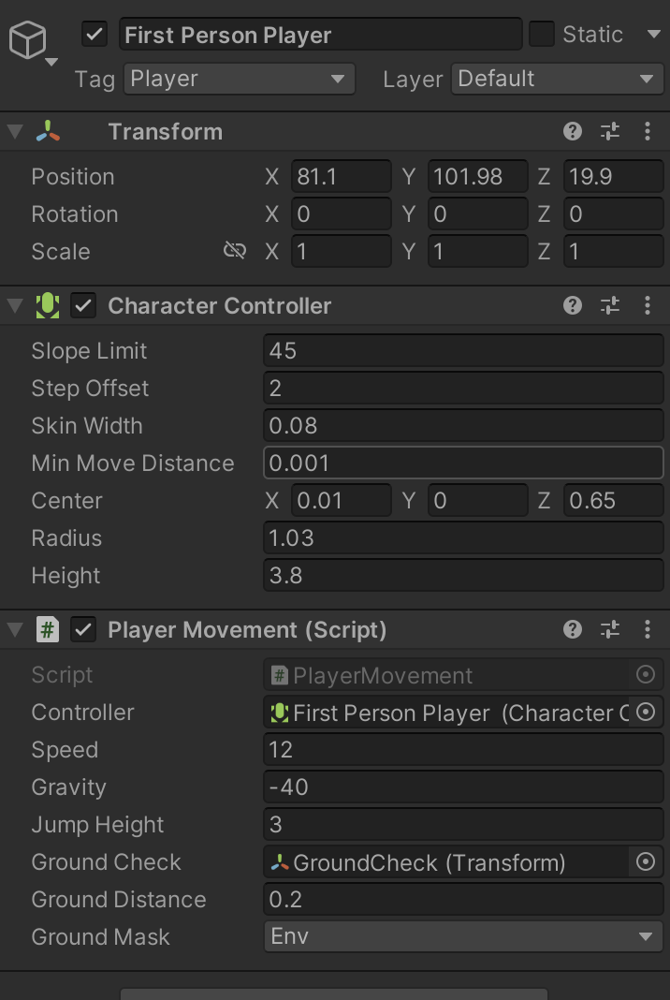

-  射击效果（2分）：

弩箭射偏掉落等着捡起：

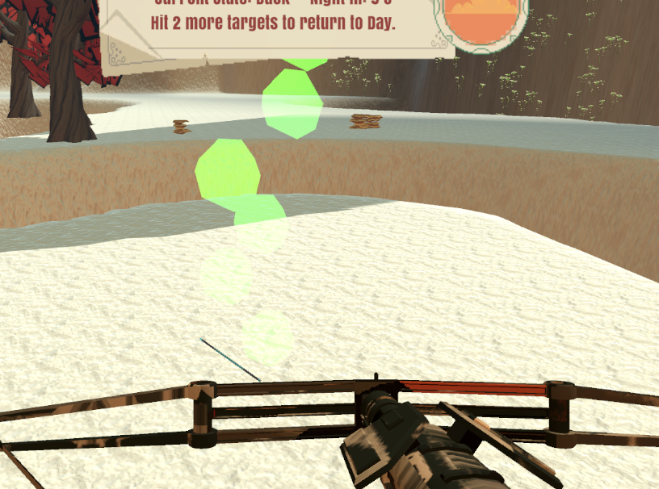

运动靶被射中后插上箭，静止3s再恢复运动：

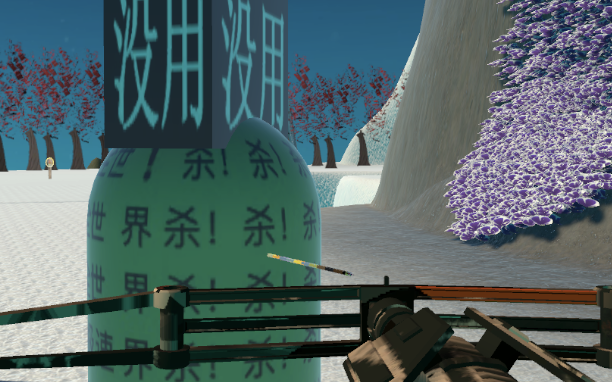

-  碰撞与计分（2分）：

击中固定靶子得分，击中运动靶来延缓其追上玩家的时间，每轮游戏在运动靶追上玩家时结束，记录击中固定靶子的最多数量，一个一分。

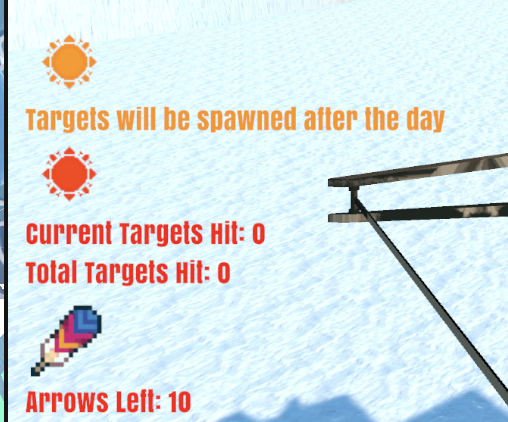

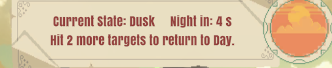

-  驽弓动画（2分）：

静止时弩弓微侧正弦微微摆动：

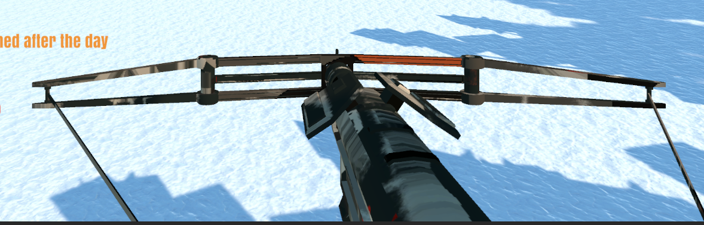

右键瞄准，滚轮调整射击力，射击时弩箭从弩里飞出：

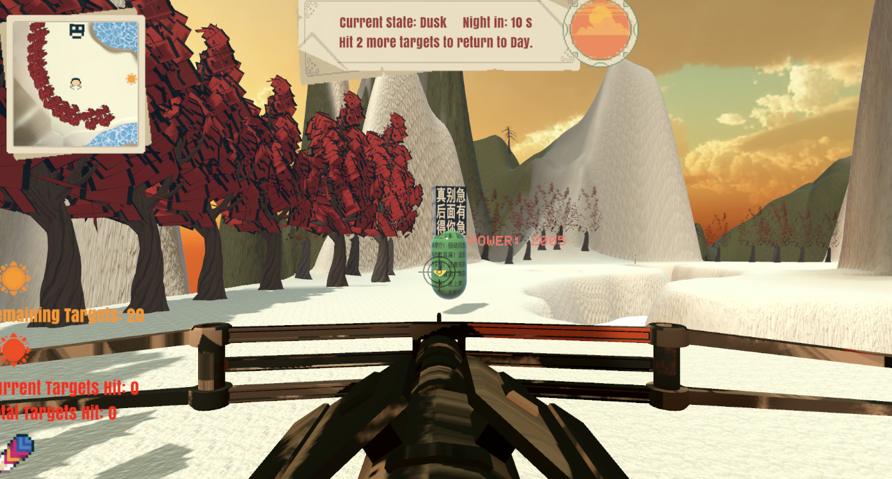

### 游戏与创新（不限项，每项 2 分）

-  场景与道具类: 

地图设计为圆，有水，水坑不可进入，黄昏与夜晚游戏在可击中区域随机生成20个固定靶子，靶子被击中后5s后会在随机区域生成新靶子。

-  效果类：如显示箭的轨迹，特殊声效

箭飞出有尾迹：

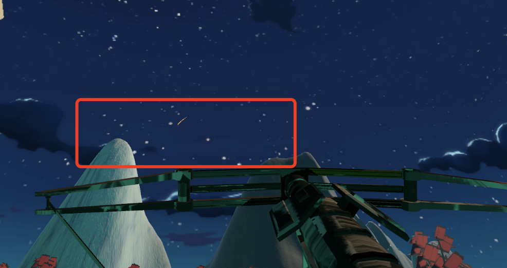

-  力场类: 如运用力场实现 ai 导航 与 捕获等

运动靶子会追逐玩家。

-  玩法类:

见1 游戏规则简介。

## 4 游戏演示视频

https://www.bilibili.com/video/BV1DWqiYXEqL/
